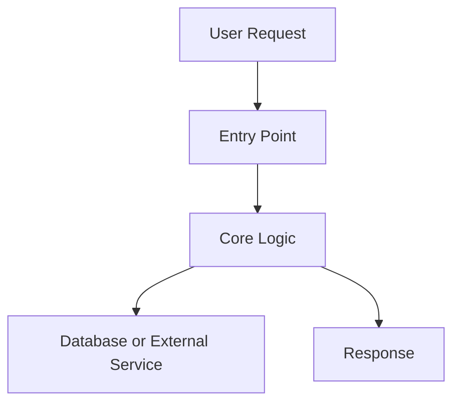
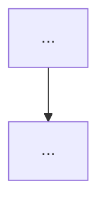

# Create Pr Summary

Use this workflow.

## Workflow

1. Confirm branch and base.
   - Use the current branch as head.
   - Always set base to `main`.
   - Run `git fetch origin` before comparing.
   - Branch naming convention is `<author>/<feature-slug>`.
   - If creating a new branch, derive `author` from `gh api user --jq .login` (fallback: `git config user.name` slugified).
   - If current branch does not follow `<author>/<feature-slug>`, rename it before creating PR when safe:
     - `git branch -m <author>/<feature-slug>`
     - `git push -u origin <author>/<feature-slug>`
     - if old remote branch exists: `git push origin --delete <old-branch>` (only after confirming no one else depends on it).
2. Confirm there is PR content.
   - Run `git log --oneline origin/main..HEAD`.
   - If no commits exist between head and `main`, stop and report the block.
3. Gather change context.
   - Collect changed files with `git diff --name-status origin/main...HEAD`.
   - Collect key hunks with `git diff --stat` and targeted `git diff` reads.
   - Collect validation commands already run (tests, type-check, lint).
4. Draft PR body with these sections.
   - `Summary`: 3-6 bullets of behavior-level changes.
   - `Why`: short reason for the change.
   - `Validation`: exact commands and results.
   - `Risks/Notes`: migrations, env changes, follow-ups.
   - `Diagram`: Mermaid flow showing change impact.
5. Create PR.
   - Use `gh pr create --base main --head <branch> --title "<title>" --body-file <file>`.
   - If PR already exists, use `gh pr edit` to update title/body.
6. Merge PR (only when user explicitly asks to merge).
   - Confirm checks/status first: `gh pr checks <number>` or `gh pr view --json statusCheckRollup`.
   - Merge using squash by default: `gh pr merge <number> --squash --delete-branch`.
   - If repository policy requires rebase/merge commit, follow repo rule instead.
7. Report outcome.
   - Return PR URL.
   - Return final summary and Mermaid block.
   - If merged, return merge commit SHA and merged-at timestamp.

## Mermaid Rules

- Prefer `flowchart TD`.
- Keep 4-10 nodes.
- Use file/module names in node labels.
- Show real data/control flow only.
- Do not draw speculative paths.

Use this template:



## PR Body Template

````markdown
## Summary
- ...

## Why
- ...

## Validation
- `npm run type-check` (pass)

## Diagram

````
